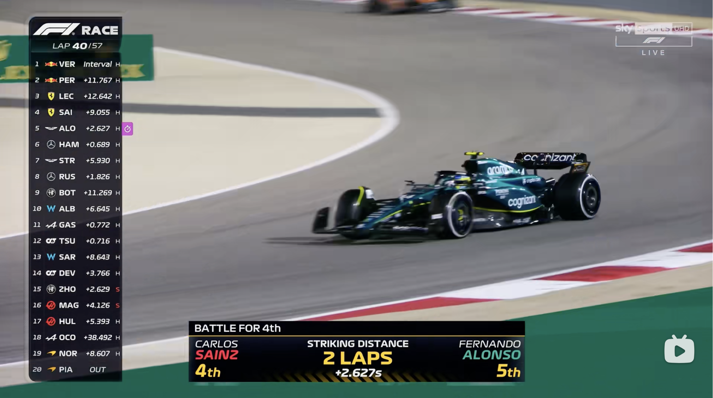
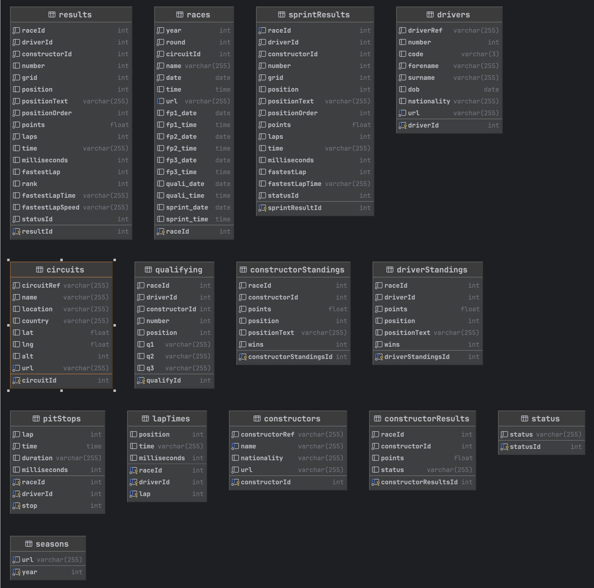
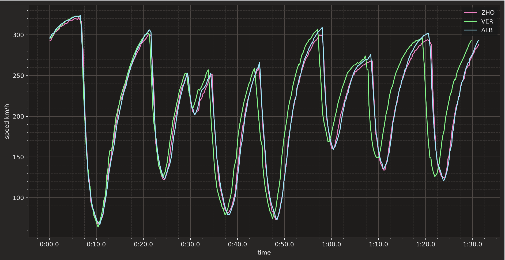
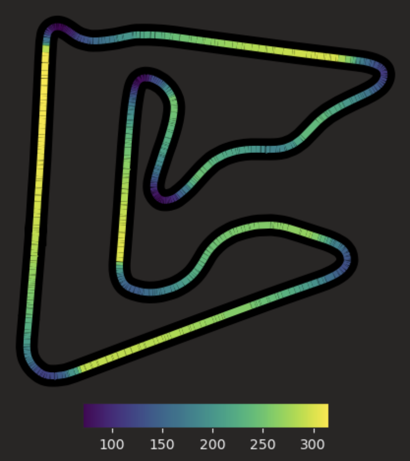
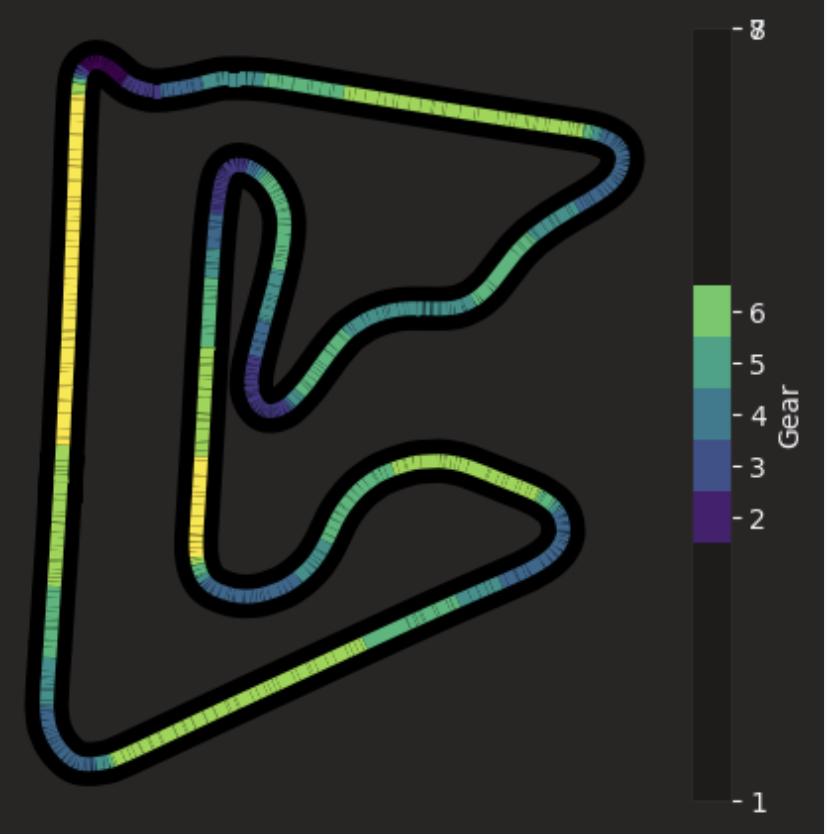

# **Analyze Formula 1 Data with Visualization Approach**

## 1. Introduction and Background

Founded by FIA, Formula 1 (F1) racing is the highest in all motor sports, and it is the most complex sport in the world. It is no longer just about the skill of drivers, the race results have close relationship with teamwork, including car and aerodynamic design, commercial promotion, racing strategy, even about luck. Teams are often up to 500 people in size. The efforts of so many people are encapsulated in the results of the 20 annual contests. So it is crucial for teams to understand and improve racing performance.

In this project, our goal is to design a system to better visualize the course of a race, compare different drivers、teams and seek for improves.

---

## 2. Related Works —— AWS Formula 1 Insights

As an official partner, Amazon AWS provides data analysis support for Formula 1 game organizer and constructors (teams). For us, this is a good case study.

Formula 1 Insights empowering Formula 1 in three major ways. First, it helps FIA to organize and analysis massive aerodynamic data to improve the rulemaking so that game becomes more intense and they are more enjoyable to watch. Second, it helps teams to set up race strategy in order to gain more advantages on the field, it also helps teams with car design and production management. Third, it improves audiences experience. In the telecast, we can see more data and predictions, see below(A catch-up forecast example).

It's too high a hurdle for us to do an aerodynamic analysis, so for this project, we're going to analyze the data available to us from a fan's perspective, and our work will focus on the third aspect of the above statement.

---

## 3. Data Source

We use data on `ergast.com` as data source, it provides developer apis and abundant data from the beginning of Formula 1 in 1950. We have already import the data into database. The diagram is shown below.

Through this database, we can easily obtain the team/driver of a particular race, race time, lap times during the race and race results. This is the first step of out work.

We use Fastf1 api as another data source, it provides essential telemetry data for us to analyze single race. There are some preliminary inspection of the data using matplotlib.

Pic1: Inspection of speed/time relation in single lap

Pic2: Inspection of speed/position relation in single lap

Pic3: Inspection of speed/gear relation in single lap

The remote sensing information provides the xy coordinates of the car. By dividing each lap of the track into several segments, we can obtain vehicle information such as speed/gear/throttle opening/brake opening of each segment.

This allows us to obtain the exact braking position of each car and visually see the different performance gaps between the cars.

The next step is to redraw the diagram and add interactivity using d3.

---

### 4. Technology Stack

We will be using Flask and relative plugins as backend server and pandas as data processor, they are flexible and work well with our workflow.

We will be using matplotlib to do the initial exploration and selection (see above).

We will be using React, D3 and leaflet as our frontend framework.

#### 4.1 Combination with React and Other Components

The main problem in the combined application of D3.js and React framework is that D3.js requires complete control of DOM nodes. However, the design philosophy of React framework is to avoid direct operation of DOM as much as possible, so there are incompatibility between the two design concepts.

Although React has JSX syntax and seems to embed HTML similar DOM tree in JS, these are all virtual DOM nodes. Different from the DOM in actual rendering, D3.js cannot operate these virtual DOM directly. Therefore, the general solution is to give a DOM node reference (ref) in the React component, giving D3.js full control of the internal parts of the node, and the rest is handled by React. However, the latest version of React recommends writing based on hooks and functional components, which does not provide a strict lifecycle approach and can only use hooks for simulation, which makes problems like repeated rendering unsolved.

The solution is to empty the useEffect dependency list, which guarantees that the DOM will only be initialized once, and then store the nodes that need to be activated as the data changes in the component's state. Then write another useEffect hook that is triggered by data updates, using only the saved states to manipulate the action effect.

---

## 5. Data Analysis Aspects

### 5.1 Analysis about Circuits

The circuit is a very important part of the f1 race, and different circuits have different characteristics, so that the race style is diversified. As the concern of fans, we will process and display the track data, including: the number of races held on the track, the average lap times of cars on the track, the visual comparison of different tracks, the track position in the map, etc.

We will use leaflet to display the geometry position for each circuits, this page will become the welcoming page.

### 5.2 Analysis about Pit Stop and Lap time

Pitstops are very important part in the f1 race. Changing the tire at a reasonable time can help drivers gain advantages in the field. In this project, we will analyze the time of drivers' pit stops and lap time.

In this section, we will use more visualizations to help us better understand how lap times change with tire exhaustion. We will use charts to better understand how early or late pit stops give drivers a position advantage.

We will also try to answer a question on the minds of every formula 1 fans: which teams make the most mistakes during pit stops? How long was the average loss?

In this process, we need to cluster and analyze the data. Due to the limitation of the original data, some pit stops with longer time need to be specially processed, such as unusually long pit stops caused by weather or track accidents. We need to process these data by comparison (do other drivers pit at unusual times in the same race at the same time?). At the same time, we need to process the data before and after 2010 separately, because f1 race has cancelled the refueling pit stop after 2010, and the strategy and time of pit stop has changed significantly.

We wanted to build a complete visual lap analysis, including real-time data, driver selection and other supporting data, but due to the complexity of building applications using react, we needed more time to demonstrate the results.

---

## 6. Reference

1.  Massey, Kenneth." Statistical models applied to the rating of sports teams." *Bluefield College* 1077(1997).
2.  AmazonF1Insights.[Online].Available:https://aws.amazon.com/cn/sports/f1/
3.  Knorr-Held, Leonhard. "Dynamic rating of sports teams." *Journal of the Royal Statistical Society: Series D (The Statistician)* 49.2 (2000): 261-276.
4.  Formula1 race results. [Online]. Available:https://www.formula1.com/en/results.html/2023/races.html
5.  Formula1Data Analysis Tutorial. [Online]. Available:https://medium.com/@jaspervhat/formula-1-data-analysis-tutorial-2021-russian-gp-to-box-or-not-to-box-da6399bd4a39
6.  FastF1 Documentation. [Online]. Available: https://docs.fastf1.dev/core.html#data-objects

